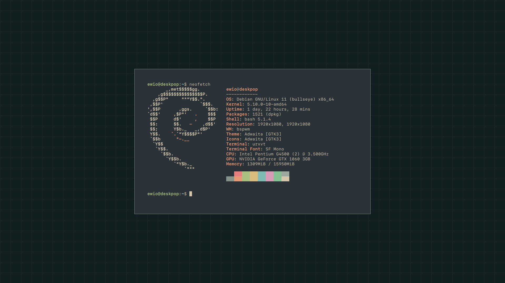
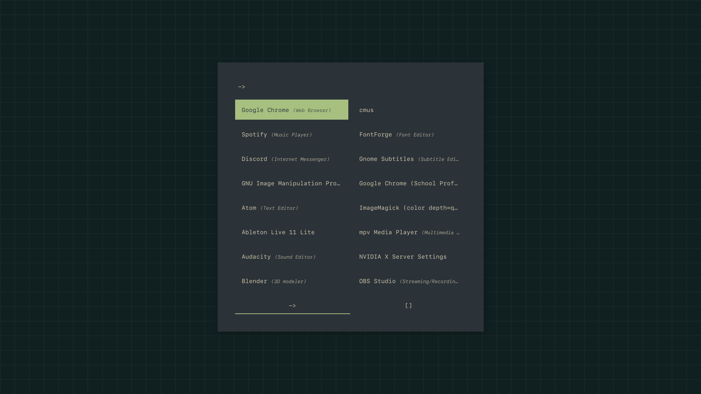
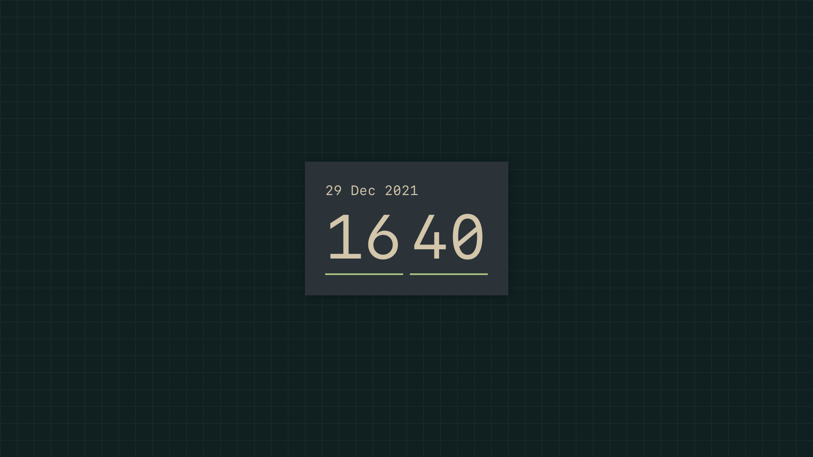

# dotfiles

this repo holds the dotfiles that i use, probably not up to date, more just uploaded here for posterity

this repo contains:

* xinit
* bspwmrc
* sxhkdrc
* rofi app launcher + window switcher
* rofi time applet
* compton conf
* Xresources
* wallpaper
* fontconfig fonts.conf
* vimrc (practically nonexistent)
* ranger rc.conf
