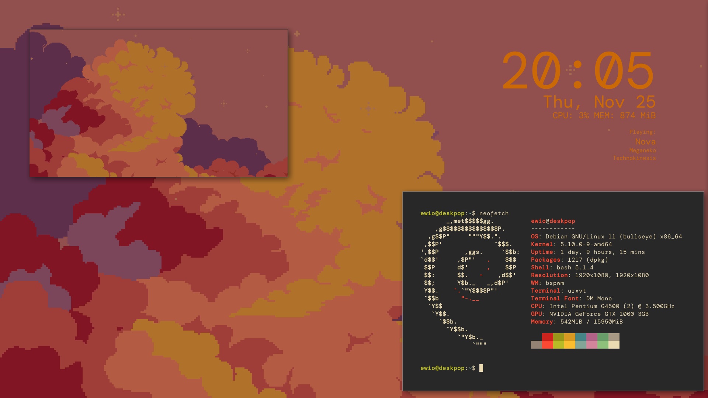

# dotfiles

this repo holds the dotfiles that i use, probably not up to date, more just uploaded here for posterity

this repo contains:

* bspwmrc
* sxhkdrc
* conky + cmus-remote script
* rofi theme
* compton conf
* Xresources
* wallpaper ([source](https://s4m-ur4i.itch.io/pixelart-clouds-background), i changed the colors for darker theme)
* fontconfig fonts.conf
* vimrc (practically nonexistent)
* ranger rc.conf
